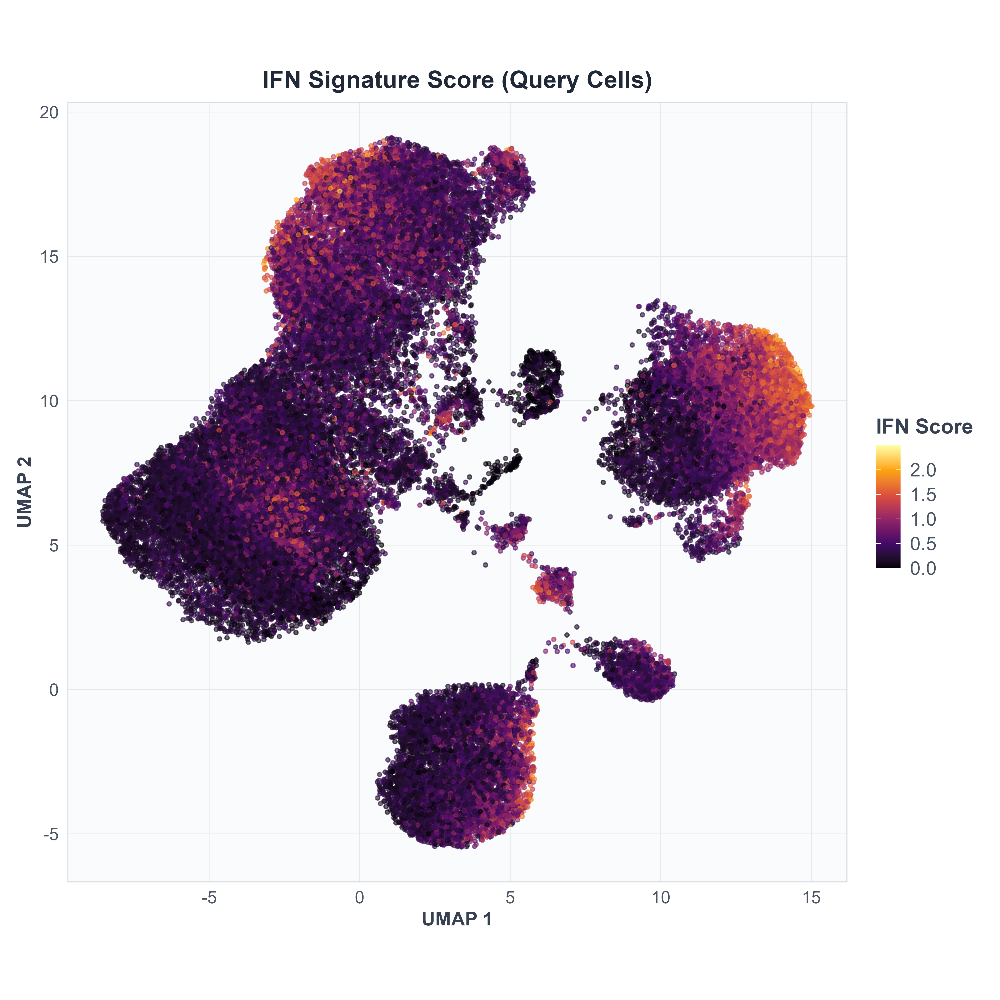
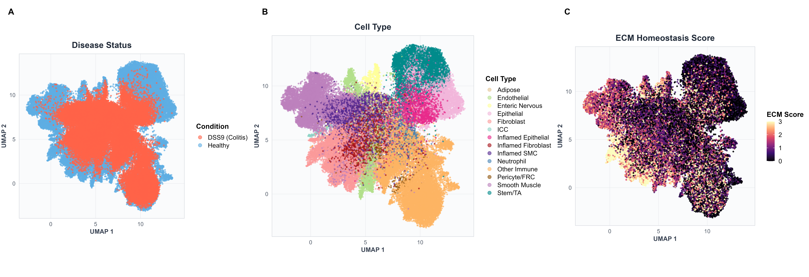
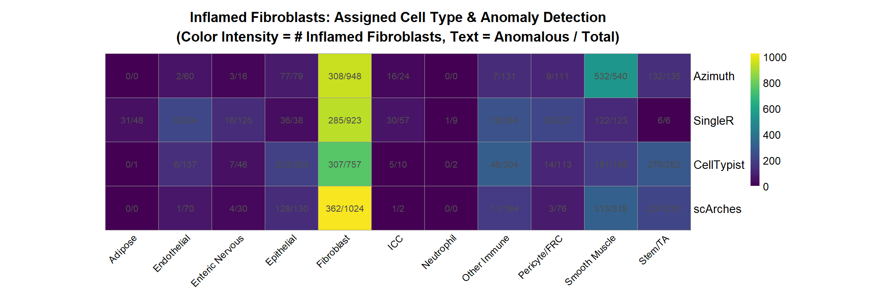

## Overview

This page demonstrates complementary aspects of `scDiagnostics` anomaly detection alongside built-in quality metrics from the four major annotation tools. We systematically compare how annotation confidence scores relate to detected anomalies and explore gene expression patterns in anomalous versus typical cells.

**Code location:** `R/covid/` and `R/merfish/` directories contain supplementary analysis scripts that generate all figures and tables shown below.

---

## Part 1: Annotation Quality Overview (COVID-19)

### Confidence Score Distributions Across All Cells

The first visualization provides a comprehensive overview of how each annotation method assigns cell types and confidence scores across the entire dataset.

**Script:** `R/covid/COVID Supplementary Figure 1.R`

**What it does:**

- Projects all cells into the same dimensionality reduction space (UMAP)
- Colors cells by predicted cell type for each method
- Overlays the method-specific confidence/uncertainty scores
- Creates a 4-row × 2-column comparison (cell type + confidence score per method)

**Outputs:** 

- **Fig S1A-B:** Azimuth cell types and prediction scores
- **Fig S1C-D:** SingleR cell types and delta scores
- **Fig S1E-F:** CellTypist cell types and confidence scores
- **Fig S1G-H:** scArches cell types and uncertainty scores

```{r}
#| eval: false
knitr::include_graphics("figs/supp/covid/Fig_S1_umaps.png")
```

---

### Disease-Associated Signature Expression

The interferon (IFN) signature provides a biological marker of disease state independent of annotation method.

**Script:** `R/covid/COVID Supplementary Figure 2.R`

**What it does:**

- Calculates mean expression of 25 interferon-responsive genes (Yoshida et al. signature)
- Visualizes IFN score distribution across the UMAP projection
- Shows high expression in immune-activated cells

**Output:**

- **Fig S2:** IFN signature score across all query cells

```{r}
#| eval: false

```

---

## Part 2: Anomaly Detection & Annotation Confidence (COVID-19)

### Principal Component Analysis with Confidence Scores

This analysis projects both reference and query cells into shared PCA space and examines how annotation confidence relates to position in this space.

**Script:** `R/covid/COVID Supplementary Figure 3.R`

**What it does:**

- Projects healthy reference and COVID query cells into PCA space
- For each annotation method:
  - Left panel: PCA with points colored by confidence/uncertainty scores
  - Middle panel: PCA with points colored by IFN signature score
  - Right panel: PCA with anomalous cells highlighted in red
- Focuses on CD14+ monocytes as a well-defined, abundant cell type
- Creates ridge density plots on diagonal to show score distributions
- Generates 4-row × 3-column grid (one row per method)

**Key observations:**

- Reference cells cluster tightly; query cells show wider scatter
- High-confidence query cells tend to cluster near reference cells
- Anomalous cells detected by isolation forests often occupy peripheral positions in PCA space

**Outputs:**

- **Fig S3A-C:** Azimuth (prediction score, IFN score, anomalies)
- **Fig S3D-F:** SingleR (delta score, IFN score, anomalies)
- **Fig S3G-I:** CellTypist (confidence score, IFN score, anomalies)
- **Fig S3J-L:** scArches (uncertainty score, IFN score, anomalies)

```{r}
#| eval: false
knitr::include_graphics("figs/supp/covid/Fig_S3_pca_comparison.png")
```

**Table S3:** Wilcoxon test comparing IFN signature expression between anomalous and non-anomalous CD14+ monocytes for each method.

---

### Confidence Score Distributions by Anomaly Status

This analysis directly examines whether annotation confidence scores differ between cells detected as anomalous versus typical.

**Script:** `R/covid/COVID Supplementary Figure 4.R`

**What it does:**

- Stratifies CD14+ monocytes by anomaly status (anomalous vs. non-anomalous)
- For each annotation method:
  - Creates density plots of confidence scores for each group
  - Enables visual comparison of score distributions
  - Tests for significant differences (Wilcoxon rank-sum test)
- Creates 2-row × 2-column grid (one column per method)

**Key observations:**

- Anomalous cells typically have lower confidence scores
- Distribution shifts are method-dependent
- Some methods show stronger separation than others

**Outputs:**

- **Fig S4A:** Azimuth prediction scores
- **Fig S4B:** SingleR delta scores
- **Fig S4C:** CellTypist confidence scores
- **Fig S4D:** scArches uncertainty scores

```{r}
#| eval: false
knitr::include_graphics("figs/supp/covid/Fig_S4_confidence_scores.png")
```

**Table S4:** Wilcoxon test results showing median confidence scores for anomalous vs. non-anomalous cells and statistical significance.

---

## Part 3: Gene Expression Patterns in Anomalies (COVID-19)

### Interferon Gene Expression Shifts

This comprehensive analysis examines how interferon-responsive genes are dysregulated in anomalous cells.

**Script:** `R/covid/COVID Supplementary Figure 5.R`

**What it does:**

- For each annotation method, stratifies CD14+ monocytes by:
  - **Left column:** Annotation tool confidence quantiles (high vs. low confidence query cells)
  - **Right column:** scDiagnostics anomaly detection (anomalous vs. non-anomalous query cells)
  
- Calculates pseudo-bulk log₂ fold changes relative to reference
- Displays fold changes for all 25 interferon genes
- Correlates gene expression patterns between the two stratification approaches
- Creates 4-row × 2-column grid (one row per method)

**Key observations:**

- Strong concordance between confidence-based and anomaly-based stratifications
- Anomalous cells show elevated IFN gene expression
- Low-confidence cells also exhibit IFN upregulation
- Gene patterns are consistent across annotation methods

**Outputs:**

- **Fig S5A-B:** Azimuth (confidence quantiles, anomaly detection)
- **Fig S5C-D:** SingleR (confidence quantiles, anomaly detection)
- **Fig S5E-F:** CellTypist (confidence quantiles, anomaly detection)
- **Fig S5G-H:** scArches (confidence quantiles, anomaly detection)

```{r}
#| eval: false
knitr::include_graphics("figs/supp/covid/Fig_S5_gene_expression_shifts.png")
```

**Table S5:** Spearman correlation between annotation confidence-based and anomaly-based gene expression shifts, showing high agreement across methods.

---

## Part 4: Spatial Annotation Overview (MERFISH)

### Disease State and Cell Type Distribution

This analysis provides an overview of the spatial landscape in healthy versus inflamed colon tissue.

**Script:** `R/merfish/MERFISH Supplementary Figure 1.R`

**What it does:**

- Projects all cells into UMAP space (computed from scVI latent space)
- Visualizes disease status (healthy vs. DSS9 day 9 colitis)
- Shows cell type spatial distribution
- Overlays ECM homeostasis score computed from five key fibroblast genes

**Outputs:**

- **Fig S6A:** Disease status across combined UMAP
- **Fig S6B:** Cell type annotations across combined UMAP
- **Fig S6C:** ECM homeostasis score distribution

```{r}
#| eval: false

```

---

### Spatial Annotation Patterns

This analysis examines how each annotation method assigns cell types and confidence scores across the spatial tissue organization.

**Script:** `R/merfish/MERFISH Supplementary Figure 2.R`

**What it does:**

- Projects all four annotation methods (Azimuth, SingleR, CellTypist, scArches) onto spatial coordinates
- For each method: displays predicted cell types and method-specific confidence/uncertainty scores
- Creates 4-row × 2-column grid (one row per method)
- Enables direct visual inspection of spatial annotation patterns and score distributions

**Key observations:**

- Annotation agreement generally high in major cell types
- Confidence scores vary spatially, with lower scores at tissue boundaries or in rare cell types
- Methods show slightly different spatial patterns reflecting their different statistical approaches

**Outputs:**

- **Fig S7A-B:** Azimuth cell types and prediction scores (spatial)
- **Fig S7C-D:** SingleR cell types and delta scores (spatial)
- **Fig S7E-F:** CellTypist cell types and confidence scores (spatial)
- **Fig S7G-H:** scArches cell types and uncertainty scores (spatial)

```{r}
#| eval: false
knitr::include_graphics("figs/supp/merfish/Fig_S2_annotations_scores.png")
```

---

## Part 5: Anomaly Detection in Spatial Data (MERFISH)

### Inflamed Fibroblast Classification

This analysis focuses on a key disease-associated cell state: inflamed fibroblasts (IAFs), which are expanded in DSS-induced colitis.

**Script:** `R/merfish/MERFISH Supplementary Figure 3.R`

**What it does:**

- Identifies all inflamed fibroblasts (ground truth from reference annotation)
- For each annotation method, determines how IAFs are classified:
  - How many are correctly identified as fibroblasts?
  - How many are misclassified as other cell types?
- Runs `scDiagnostics` anomaly detection on each method's predictions
- Creates heatmap showing IAF distribution across predicted cell types
- Text shows proportion of cells detected as anomalous

**Key observations:**

- Most methods predict majority of IAFs as fibroblasts (high sensitivity)
- Some IAFs classified as smooth muscle cells (method-dependent misclassification)
- scDiagnostics anomaly detection flags many IAFs as outliers, even when correctly classified

**Output:**
- **Fig S8:** Heatmap of IAF predictions and anomaly detection across methods

```{r}
#| eval: false

```

---

### PCA Projection with ECM Signature

This comprehensive analysis projects healthy reference and inflamed query fibroblasts into shared PCA space and examines ECM gene expression patterns.

**Script:** `R/merfish/MERFISH Supplementary Figure 4.R`

**What it does:**

- Projects reference (healthy) and query (DSS) fibroblasts into PCA space
- For each annotation method:
  - Left panel: PCA with points colored by ECM homeostasis score
  - Right panel: PCA with anomalous fibroblasts highlighted in red
- Creates 4-row × 2-column grid (one row per method)
- Shows how fibroblasts are positioned relative to reference and whether anomaly detection identifies them

**Key observations:**

- Inflamed query fibroblasts show higher ECM scores (elevated Col1a2, Timp2, etc.)
- Anomalous cells tend to occupy peripheral positions in PCA space
- Reference fibroblasts cluster tightly; query cells show wider scatter reflecting disease-induced heterogeneity

**Outputs:**

- **Fig S9A-B:** Azimuth (PCA + ECM, anomaly detection)
- **Fig S9C-D:** SingleR (PCA + ECM, anomaly detection)
- **Fig S9E-F:** CellTypist (PCA + ECM, anomaly detection)
- **Fig S9G-H:** scArches (PCA + ECM, anomaly detection)

```{r}
#| eval: false
knitr::include_graphics("figs/supp/merfish/Fig_S4_pca_ecm_anomaly.png")
```

---

### ECM Gene Expression in Anomalies

This final analysis focuses specifically on the five ECM homeostasis genes and how their expression differs between anomalous and typical cells.

**Script:** `R/merfish/MERFISH Supplementary Figure 5.R`

**What it does:**

- Analyzes expression of five key ECM genes: Col1a2, Timp2, Col6a1, Sparc, Dpt
- For each annotation method:
  - Calculates pseudo-bulk log₂ fold changes relative to healthy reference
  - Compares anomalous vs. non-anomalous fibroblasts
  - Creates barplot showing gene-by-gene patterns
- Creates 2-row × 2-column grid (one cell per method)

**Key observations:**

- Anomalous fibroblasts show elevated ECM gene expression across all methods
- Elevation is consistent and robust across the four annotation approaches
- Col1a2 shows particularly strong upregulation in anomalous cells (Table S6)

**Outputs:**

- **Fig S10:** ECM gene expression shifts across all four methods

```{r}
#| eval: false
knitr::include_graphics("figs/supp/merfish/Fig_S5_ecm_barplot.png")
```

**Table S6:** Col1a2 expression comparison between anomalous and non-anomalous fibroblasts, with t-test statistics showing significant upregulation in anomalous cells across all annotation methods.

---

## Summary

These comprehensive supplementary analyses demonstrate that:

1. **COVID-19 scRNA-seq:**

   - Annotation confidence and anomaly detection are concordant
   - Anomalies have distinct molecular signatures (elevated interferon response)
   - Patterns are consistent across all four annotation methods

2. **MERFISH Spatial Data:**

   - Spatial context reveals how anomalies organize within tissue
   - Disease-associated fibroblasts show elevated ECM expression
   - Anomaly detection identifies biologically relevant cell states

3. **Cross-Dataset Findings:**

   - Annotation confidence scores reliably predict anomaly status
   - Gene expression patterns align between confidence-based and anomaly-based stratifications
   - `scDiagnostics` complements rather than replaces annotation tool scores

---

## Complete Analysis Pipeline

To reproduce all supplementary analyses:

```{r}
#| eval: false
# COVID-19 analyses
source("R/covid/COVID Supplementary Figure 1.R")
source("R/covid/COVID Supplementary Figure 2.R")
source("R/covid/COVID Supplementary Figure 3.R")
source("R/covid/COVID Supplementary Figure 4.R")
source("R/covid/COVID Supplementary Figure 5.R")

# MERFISH analyses
source("R/merfish/MERFISH Supplementary_Figure 1.R")
source("R/merfish/MERFISH Supplementary_Figure 2.R")
source("R/merfish/MERFISH Supplementary_Figure 3.R")
source("R/merfish/MERFISH Supplementary_Figure 4.R")
source("R/merfish/MERFISH Supplementary_Figure 5.R")
```

All figures and tables are saved to `figures/supp/covid/` and `figures/supp/merfish/`.