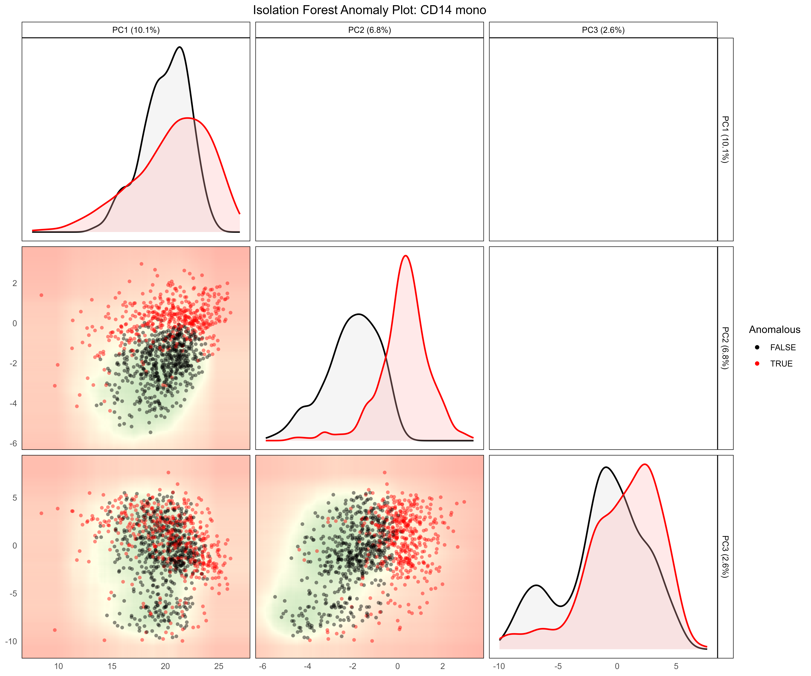

## What is scDiagnostics?

**The Problem:** Cell type annotation is a critical step in single-cell RNA-seq analysis. Most researchers use reference-based annotation tools (like `SingleR` or `Azimuth`) to automatically assign cell types to new cells by comparing them to well-characterized reference datasets. However, these tools provide only a cell type label and a confidence score—they don't tell you *why* a cell might be uncertain, or whether the reference and query datasets are fundamentally compatible.

**The Solution:** `scDiagnostics` provides systematic diagnostic tools to evaluate annotation quality beyond simple confidence scores. It helps you:

- **Assess dataset alignment** — Are your query and reference datasets similar enough for reliable annotation transfer?
- **Detect anomalous cells** — Identify cells that deviate from reference structure, suggesting novel states, batch effects, or annotation issues
- **Understand gene expression shifts** — Quantify which genes drive differences between query and reference, and whether these shifts are biological or technical
- **Compare annotation methods** — Validate results across multiple annotation tools to increase confidence

For a complete overview of all available functions, visit the [scDiagnostics reference page](https://ccb-hms.github.io/scDiagnostics/reference/index.html) or the [Bioconductor package page](https://www.bioconductor.org/packages/release/bioc/html/scDiagnostics.html).

## Before You Start: Data Requirements

### What You Need

`scDiagnostics` works with **SingleCellExperiment (SCE)** objects—standard containers for single-cell data in R/Bioconductor. You need:

1. **A reference SCE object** — Well-annotated cells with known cell type identity
2. **A query SCE object** — New cells you want to annotate or diagnose
3. **Both with log-normalized counts** — `scDiagnostics` assumes data is log-transformed (typically `logcounts` assay)
4. **Both with cell type annotations** — Column(s) in `colData()` containing cell type labels

### Getting Started

::: {.callout-tip}
## Step 1: Install scDiagnostics and Dependencies

See **[Setup & Installation](setup.qmd)** in the Data & Methods section for complete installation instructions.
:::

::: {.callout-tip}
## Step 2: Obtain Pre-processed Data

Pre-processed reference and query SCE objects are available for download. See **[Getting Data](data-access.qmd)** in the Data & Methods section.
:::

::: {.callout-tip}
## Step 3: Add Cell Type Annotations

If your data doesn't yet have annotations, see **[Adding Annotations](adding-annotations.qmd)** in the Data & Methods section to learn how to run SingleR, Azimuth, CellTypist, or scArches.
:::

::: {.callout-tip}
## Step 4: Prepare Data for Analysis

See **[COVID-19 Processing](processing-covid.qmd)** and **[MERFISH Processing](processing-merfish.qmd)** for examples of data preprocessing workflows (QC filtering, normalization, PCA computation).
:::

## Quick Start Tutorial

Below is a simple, step-by-step workflow using COVID-19 PBMC data to demonstrate core `scDiagnostics` functionality.

### Load Data and Verify Requirements

```{r}
#| eval: false
#| code-fold: false

library(scDiagnostics)

# Load your data (see Getting Data section for download instructions)
healthy_data <- readRDS("data/covid/normal_data_sce.rds")
covid_data <- readRDS("data/covid/covid_data_sce.rds")

# Verify both have logcounts
assayNames(healthy_data)
assayNames(covid_data)

# Verify both have annotations in colData
head(colData(healthy_data))
head(colData(covid_data))
```

### Step 1: Visualize Query vs. Reference in PCA Space

Visualize how your query cells project onto the reference PCA space to get an intuitive sense of dataset alignment.

```{r}
#| eval: false
#| code-fold: false

# Project query cells onto reference PCA space
pca_plot <- plotCellTypePCA(
    query_data = covid_data,
    reference_data = healthy_data,
    query_cell_type_col = "azimuth_celltype_l1_merged",
    ref_cell_type_col = "author_cell_type_merged",
    cell_types = "CD14 mono",
    pc_subset = 1:3
)

pca_plot
```

**What to look for:** 

- **Diagonal panels:** Density distributions of principal components. Reference cells (blue) tightly clustered, query cells (purple) overlapping = good alignment
- **Lower scatter panels:** Individual cells plotted. Query cells (filled circles) nested within reference (hollow circles) = well-matched datasets
- **Separated distributions:** Query cells shifted far from reference = potential biological shift or technical incompatibility


### Step 2: Detect Anomalous Cells

Use isolation forests to identify cells deviating from the reference transcriptomic structure.

```{r}
#| eval: false
#| code-fold: false

# Detect anomalies in query data
anomaly_results <- detectAnomaly(
    reference_data = healthy_data,
    query_data = covid_data,
    query_cell_type_col = "azimuth_celltype_l1_merged",
    ref_cell_type_col = "author_cell_type_merged",
    cell_types = "CD14 mono",
    pc_subset = 1:5,
    anomaly_threshold = 0.5,
)

# Visualize anomaly results
plot(anomaly_results, 
     cell_type = "CD14 mono",
     pc_subset = 1:3,
     data_type = "query")
```

**Interpretation:**

- **Red dots** = Anomalous cells (deviate from reference structure)
- **Green/black dots** = Non-anomalous cells (match reference structure)
- **Clustered anomalies** = Coordinated biological response (e.g., disease activation)
- **Scattered anomalies** = Potential quality control issues



### Step 3: Quantify Gene Expression Shifts

Identify which genes drive differences between query and reference using supervised analysis of interferon-stimulated genes.

```{r}
#| eval: false
#| code-fold: false

# Define Yoshida interferon signature genes
ifn_genes <- c(
    "BST2", "CMPK2", "EIF2AK2", "EPSTI1", "HERC5", "IFI35", "IFI44L",
    "IFI6", "IFIT3", "ISG15", "LY6E", "MX1", "MX2", "OAS1", "OAS2",
    "PARP9", "PLSCR1", "SAMD9", "SAMD9L", "SP110", "STAT1", "TRIM22",
    "UBE2L6", "XAF1", "IRF7"
)

# Subset to IFN genes only (supervised analysis)
healthy_data_ifn <- healthy_data[ifn_genes, ]
covid_data_ifn <- covid_data[ifn_genes, ]

# Calculate gene expression shifts
gene_shifts <- calculateGeneShifts(
    query_data = covid_data_ifn,
    reference_data = healthy_data_ifn,
    query_cell_type_col = "azimuth_celltype_l1_merged",
    ref_cell_type_col = "author_cell_type_merged",
    cell_types = "CD14 mono",
    pc_subset = 1:5,
    anomaly_threshold = 0.5,
    detect_anomalies = TRUE,
    anomaly_comparison = TRUE
)

# Visualize as heatmap
plot(gene_shifts,
     cell_type = "CD14 mono",
     plot_type = "heatmap")

# Visualize as barplot
plot(gene_shifts,
     cell_type = "CD14 mono",
     plot_type = "barplot")
```

**What you see:**

- **Rows** = Individual interferon-stimulated genes
- **Columns** = Stratified cell groups (all query, anomalous only, non-anomalous only)
- **Red/warm colors** = Upregulated genes in query
- **Blue/cool colors** = Downregulated genes in query
- **Coordinated upregulation** (entire pathway activated) = Likely interferon response to disease
- **Pattern consistency** between heatmap and barplot validates findings


### Step 4: Interpret Results

Answer three questions based on diagnostics:

**Q1: Are reference and query aligned?**

- ✓ YES (overlapping PCA distributions) → Proceed with confidence
- ✗ NO (separated distributions) → Investigate batch effects before downstream analysis

**Q2: Are there anomalous cells?**

- ✓ Few (< 10%) → Data matches reference well
- ✗ Many (> 30%) → Major transcriptomic shift or reference mismatch

**Q3: What drives anomalies?**

- ✓ Coordinated pathways (gene modules shift together) → Likely biological signal (disease, activation)
- ✗ Scattered genes → May indicate quality issues or technical artifacts

## Core Functions at a Glance

This tutorial demonstrates three foundational functions. `scDiagnostics` provides **20+ additional functions** for in-depth analysis:

**Visualization & Exploration**

- `plotCellTypePCA()` — PCA projections with density overlays
- `plotMarkerExpression()` — Gene expression distributions
- `plotCellTypeMDS()` — Alternative dimensionality reduction view

**Dataset Alignment Assessment**

- `calculateWassersteinDistance()` — Statistical distance between distributions
- `comparePCASubspace()` — Compare PC loadings between datasets
- `calculateAveragePairwiseCorrelation()` — Cell-to-cell similarity scores

**Anomaly & Outlier Detection**

- `detectAnomaly()` — Isolation forest-based anomaly scores
- `calculateCellDistances()` — Individual cell distances to reference
- `calculateCellSimilarityPCA()` — Similarity metrics per cell

**Marker Gene Analysis**

- `calculateGeneShifts()` — Gene expression changes
- `calculateVarImpOverlap()` — Gene importance via random forest
- `compareMarkers()` — Marker gene agreement between methods

**Statistical Testing**

- `calculateHotellingPValue()` — Hotelling's T² test on PCs
- `calculateMMDPValue()` — Maximum mean discrepancy test
- `calculateCramerPValue()` — Cramer test on multivariate distributions

See the [complete reference](https://ccb-hms.github.io/scDiagnostics/reference/index.html) for full function documentation and [package website](https://ccb-hms.github.io/scDiagnostics/index.html) for additional vignettes.

## Full Analyses

We demonstrate `scDiagnostics` across three complementary analyses:

**[Simulation Analysis](results-simulation.qmd)**

- Controlled validation with known ground truth
- Tests diagnostic functions on synthetic data
- Establishes baseline performance before real biological applications

**[COVID-19 PBMC Analysis](results-covid.qmd)**

- Apply validated diagnostics to severe COVID-19 infection
- Observe disease-driven transcriptomic shifts in real patient data
- Compare anomaly detection across four annotation methods
- Understand annotation quality in dense scRNA-seq context

**[MERFISH Colitis Analysis](results-merfish.qmd)**

- Extend diagnostics to spatial transcriptomics (targeted gene panels)
- Test anomaly detection on inflamed tissue with partial reference
- Demonstrate reproducibility across different single-cell technologies
- Show how anomaly detection identifies disease-associated cell states

**[Exploring Annotation Tool Diagnostics](annotation-diagnostics.qmd)**

- Investigate built-in confidence metrics from `SingleR`, `Azimuth`, `CellTypist`, `scArches`
- Compare tool diagnostics with `scDiagnostics` anomaly detection
- Understand when tool confidence scores align (or diverge) with anomalies
- Learn which diagnostic signals are most informative for annotation quality assessment
